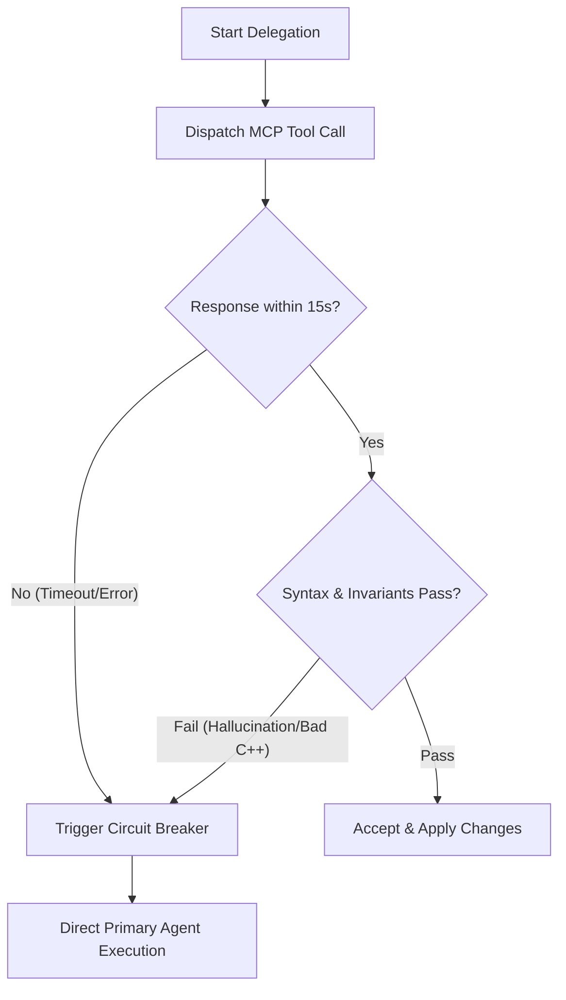

# MCP Delegation Protocol

This skill governs the delegation of atomic code generation, algorithmic optimization, and focused code inspection tasks to local Model Context Protocol (MCP) servers (`llama-cpp-mcp` and `ollama-local-bridge`).

---

## 1. Architectural Boundaries

- **Primary Agent (Orchestrator & Tech Lead):** Retains total ownership of system architecture, requirement clarification, file system modifications, and quality gate enforcement.
- **MCP Server (Execution Worker):** Operates strictly as a stateless, atomic execution worker. MCP never edits workspace rules, author plans, or prompts the user directly.

---

## 2. Delegation Eligibility Criteria

Delegate to MCP **only** when the task matches all of the following criteria:
1. **Isolated Scope:** Self-contained mathematical routine, SIMD/parallel loop kernel, unit test fixture, or isolated pure function.
2. **Context Budget:** Input code context is $\le 150$ lines.
3. **Deterministic Contract:** Input parameters, invariants, and expected outputs are mathematically or logically crisp.

**Prohibited from Delegation:**
- Architectural refactorings crossing multiple headers.
- Build system modifications (`CMakeLists.txt`).
- Direct editing of `.agents/` rules, skills, or directives.
- Open-ended discovery or exploratory workspace queries.

---

## 3. Delegation Envelope Template

When calling `call_mcp_tool` with `ask_model`, format the prompt payload strictly with the following contract wrapper:

```markdown
[ROLE: Specialized C++23 Execution Worker]
[TASK]: <Specific function or kernel to implement/refactor>
[INVARIANTS]:
- Modern C++23, RAII wrappers, zero raw pointers (new/delete).
- Cognitive complexity strictly <= 25 (readability-function-cognitive-complexity).
- Cache-line alignment (alignas(64)) for parallel shared structures; avoid false sharing.
- Zero suppression comments (no NOLINT, no NOLINTNEXTLINE).
- Pure code output only. No pleasantries, no conversational preamble.

[INPUT CONTEXT]:
```cpp
<Tight context anchor <= 150 lines>
```

[EXPECTED SIGNATURE / OUTPUT]:
```cpp
<Exact return type and function signature>
```
```

---

## 4. Backend Routing & Dispatch

| Server Name | Available Tools | Primary Use Case |
| :--- | :--- | :--- |
| **`llama-cpp-mcp`** | `ask_model`, `analyse_project` | Fast local GGUF model inference for localized C++ routines and project analysis. |
| **`ollama-local-bridge`** *(Optional)* | `ask_model`, `list_models`, `show_model` | Ollama model inference when external Ollama daemon is active. |

---

## 5. Circuit Breaker & Fallback Protocol



1. **Timeout Allocation:** If MCP tool execution exceeds **15 seconds** or returns a connection error, trigger the circuit breaker immediately.
2. **Deterministic Fallback:** Primary Agent assumes direct control and generates the required routine internally. Never retry failing MCP calls in an unbounded loop.
3. **Telemetry Logging:** Log fallback occurrences using the strict telemetry format below.

---

## 6. Audit & Verification Checklist

Before accepting any code emitted by an MCP worker, the Primary Agent MUST verify:
- [ ] **Standards:** C++20/C++23 idiom adherence (e.g., `std::span`, `std::expected`, ranges).
- [ ] **Allocations:** Zero unchecked `new` / `malloc` calls; strict RAII.
- [ ] **Cognitive Complexity:** Verify function cognitive complexity $\le 25$.
- [ ] **Suppression Audit:** Zero occurrences of `NOLINT` or `NOLINTNEXTLINE`.
- [ ] **Thread Safety:** No uncoordinated data races or false sharing hazards.

---

## 7. Telemetry Reporting Format

Whenever MCP is engaged, emit a concise checkpoint log:

```
[MCP: <ServerName>] -> [Task: <Action>] -> [Status: OK | FALLBACK] -> [Audit: PASS | REJECTED]
```

*Example:* `[MCP: llama-cpp-mcp] -> [Task: Pair correlation kernel] -> [Status: OK] -> [Audit: PASS]`
