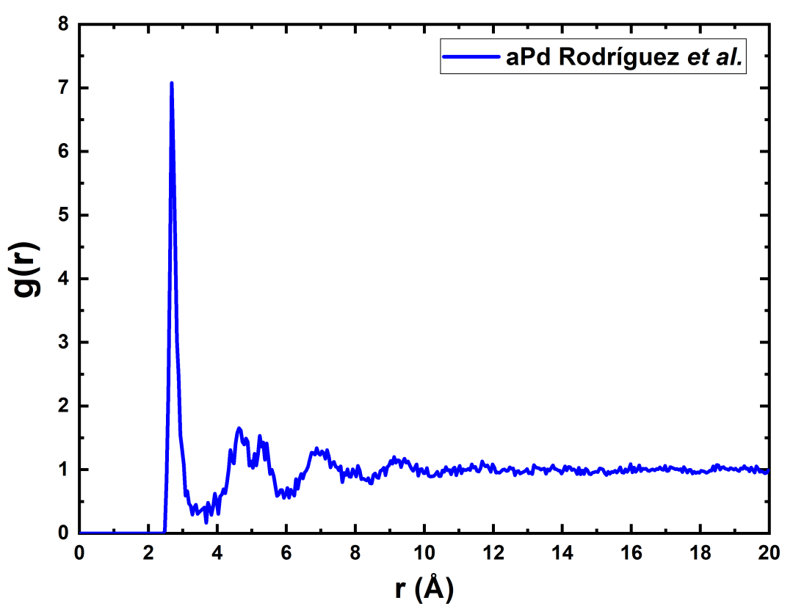

# `Correlation`: An Analysis Tool for Liquids and for Amorphous Solids

[](https://doi.org/10.5281/zenodo.5501541) [](https://img.shields.io/badge/version-1.0.1-green) [](https://img.shields.io/badge/license-MIT-brightgreen) [](code_of_conduct.md) [](https://joss.theoj.org/papers/7d5240007263a90d59d97ab464598991)

`Correlation` is an analysis tool for correlation functions and correlation related properties of materials. In particular, for atomistic structure files of heavily used material simulation software like: DMoL3 (_.CAR), CASTEP(_.CELL), ONETEP(_.DAT), LAMMPS(_.XYZ),etc...

This program calculates the main correlation functions of a material:

- Radial Distribution Function (J(r)).
- Pair Distribution Function (g(r)).
- Reduced Pair Distribution Function (G(r)).
- Coordination Number (CN).
- Plane-Angle Distribution (PAD).
- Structure Factor (S(Q)).

## Usage

---

```
    USAGE: correlation [OPTIONS] [input_file]

      The minimal argument is a structure file, this program requires a file
      that contains atom positions, crystal structure and composition.
      Supported structure files are:
        -*.CAR   Materials Studio structure file.
        -*.CELL  CASTEP structure file.
        -*.DAT   ONETEP structure file.
        -*.XYZ   LAMMPS structure file.

      OPTIONS:
        HELP OPTIONS
          -h, --help
            Display this help text.

        RADIAL OPTIONS:
          -n, --normalize
            Used to switch between weighted partials (default), or normalize all the partials to 1 when r tends to infinity.
          -r, --r_cut
            Cutoff radius in the calculation of g(r), G(r) and J(r). The default
            radius it's set to 2 nm. The maximum recommended radius is the same as
            the shortest length of the lattice parameters of the cell, anything
            above this PBC value can be affected by periodic interactions.
          -w, --bin_width
            Width of the histograms for g(r) and J(r), the default is 0.05 nm.

        STRUCTURE FACTOR OPTIONS:
          -q, --q_bin_width
            Width of the histograms for S(Q), the default is 0.157079 nm^()-1.)

        BOND-ANGLE OPTIONS:
          -a, --angle_bin_width
            Width of the histograms for the PAD, default set to 1.0°.
          -b, --bond_parameter
            The ideal covalent bond length is the sum of covalent radii
            of the two atoms. The criterion used to consider atoms as bonded
            is the following:
              0.6 * Sum_radii < distance < bond_parameter * Sum_radii.
            By default the bond_parameter is set to 1.30, as a rule of thumb.
            The default should work for most crystalline materials,
            as well as most covalent non-crystalline materials.
            For amorphous and liquid materials the bond_parameter should be
            increased to match the desired distance to cut_off the bonds.
            A bond_parameter of 1.42 is recomended for amorphous materials.
          -i, --in_bond_file
            The input file with the bond distances for every pair of elements
            in the corresponding input structure. The file should have the
            following format:
              Si Si 2.29
              Mg Mg 2.85
              C  C  1.55
              C  Si 1.86
              Si Mg 2.57
              C  Mg 2.07
            If any of the pairs is missing in the input file, the corresponding
            bond distance will be set using the bond_parameter(1.30 by default).

        OUTPUT OPTIONS:
          -o, --out_file
            The output file name, by default the input seed name will be used.
```

## Installation

---

`Correlation` is written in C++17 and is designed to be compatible with GNU Compiler Collection (GCC) v7.0 or superior.

### Prerequisites

The following steps are required for the correct compilation of `Correlation` project.

#### Windows

---

There are several (GCC) implementations for Windows, developers recommend the MSYS2 implementation:

Installing MSYS2:

```
MSYS2: https://www.msys2.org/
```

Updating MSYS2:

```
pacman -Syu
```

Installing GCC and other developer tools:

```
pacman -S --needed base-devel mingw-w64-x86_64-toolchain
```

Installing GNU Autotools:

```
pacman -S automake autoconf libtool
```

#### Unix

---

The code was tested with in Ubuntu 18.04, Debian 8.11 and MX Linux 19.3 but it should work on other distros.

Installing GCC:

```
sudo apt install build-essential
```

Installing GNU Autotools:

```
sudo apt install automake autoconf libtool
```

#### MacOS

---

The code was tested with MacOS 10.15 Catalina, with Clang 11.0.0 compilers.

Installing Clang:

```
xcode-select --install
```

Installing GNU Autotools:

```
brew install automake autoconf libtool
```

### Installing `Correlation`

---

For compiling you should have GCC or Clang compilers, and GNU Autotools correctly installed on the system.

Some systems may require the configure script to have the execute permission:

```
chmod +x configure
chmod +x install-sh
```

Execute the configure script:

```
./configure
```

Compile the code with make command:

```
make
```

Install the software in the standard binary location:

```
make install
```

## Running the tests

---

A series of test are included in the project:

1. Silicon crystal structure as published by Alvarez, _et al._ https://doi.org/10.1016/S0022-3093(01)01005-5
2. Graphene layer supercell modified from Romero, _et al._ https://doi.org/10.1016/j.jnoncrysol.2004.03.031
3. Amorphous palladium as published by Rodríguez, _et al._ https://journals.aps.org/prb/abstract/10.1103/PhysRevB.100.024422
4. Amorphous palladium hydride as published by Rodríguez, _et al._ https://arxiv.org/abs/2012.02934
5. Liquid bismuth as reported by F. B. Quiroga in her undergraduate thesis. Private communication.
6. Amorphous palladium hydride supercell created from Rodríguez, _et al._ https://arxiv.org/abs/2012.02934

To execute all of these tests execute the following command:

```
make tests
```

### Execute single test

To run a single test instead, for example to execute test 3, you should run:

```
make test3
```

or

```
correlation ./test/test_3/aPd.cell
```

If the test are executed successfully several message like this one should appear for every single test performed:

```
"----------------------------------------------------------"
" Test 3: rPDF (G_) successfully calculated."
"----------------------------------------------------------"
```

Five result(s) file(s) should be generated in the same directory as the input file(aPd.cell) as Comma Separeted Values files (\*.CSV).

1. Pair Distribution Function [**g**]("*_g.CSV").
2. Radial Distribution Function [**J**]("*_J.CSV").
3. Reduced Radial Distribution Function [**G**]("*_G.CSV").
4. Coordination Number [**Nc**]("*_Nc.CSV").
5. Plane Angle Distribution [**PAD**]("*_PAD.CSV").

These Comma Separated Values files can then be analyzed with your favorite tool like: LibreOffice Math, Office Excel, OriginPro, etc...

For example:



### Stress test

A file is included as an stress test to `Correlation` in a particular machine, this test should take several minutes to execute and may require several GB of RAM to successfully compute the correlation functions.

These are the results for palladium deuteride reported by Rodríguez, _et al._ https://arxiv.org/abs/2012.02934

```
make test7
```

### [OPTIONAL CLEANING COMMAND]

---

In order to have a clean project folder to upload to GitHub we added the optional step to clean the project folder automatically with the following command:

```
make clean-all
```

## Built With

- [Atom](https://atom.io/) - A hackable text editor for the 21st Century
- [MSYS2](https://www.msys2.org/) - Software Distribution and Building Platform for Windows

## Authors

- **Isaías Rodríguez** - _Corresponding Author_ - [Isurwars](https://github.com/Isurwars) <isurwars@gmail.com>
- **Renela M. Valladares** <renelavalladares@gmail.com>
- **Alexander Valladares** <valladar@ciencias.unam.mx>
- **David Hinojosa-Romero** <david18_hr@ciencias.unam.mx>
- **Ulises Santiago**
- **Ariel A. Valladares** <valladar@unam.mx>

## License

This project is licensed under the MIT License - see the [LICENSE](LICENSE) file for details

# Planned future features

We will continue to support and enrich the software in the foreseeable future. Here we list the features planned to be added in the future:

- Support for additional output files, like hdf5 standard.

- Inclusion of other correlation functions like Velocity Correlation Functions, to further improve the analysis of liquids and phase transitions.

- Inclusion of structure factors and x-ray diffraction, to facilitate the comparison with experimental results.

- Parallelization of the main loop, to further improve the code by switching to a ‘divide-and-conquer paradigm.

# Acknowledgments

I.R. acknowledge PAPIIT, DGAPA-UNAM for his postdoctoral fellowship.
D.H.R. acknowledge Consejo Nacional de Ciencia y Tecnología (CONACyT) for supporting his graduate studies.
A.A.V., R.M.V., and A.V. thank DGAPA-UNAM for continued financial support to carry out research projects under Grant No. IN104617 and IN116520.
M. T. Vázquez and O. Jiménez provided the information requested.
A. López and A. Pompa helped with the maintenance and support of the supercomputer in IIM-UNAM.
Simulations were partially carried out in the Supercomputing Center of DGTIC-UNAM.
I.R. would like to express his gratitude to F. B. Quiroga, M. A. Carrillo, R. S. Vilchis, S. Villareal and A. de Leon, for their time invested in testing the code, as well as the structures provided for benchmarks and tests.
