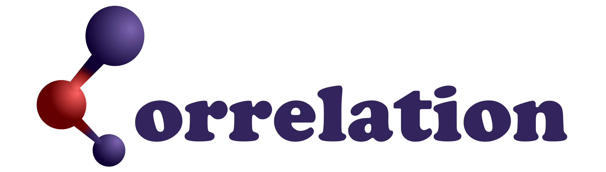

# `Correlation`: An Analysis Tool for Liquids and for Amorphous Solids

[](https://doi.org/10.5281/zenodo.5514113) [](https://img.shields.io/badge/version-3.1.0-green) [](https://img.shields.io/badge/license-MIT-brightgreen) [](docs/CODE_OF_CONDUCT.md) [](https://doi.org/10.5281/zenodo.5514113)

`Correlation` is a high-performance, user-friendly tool for calculating and analyzing the structural and dynamic properties of materials. It is designed for researchers working with atomistic simulations of liquids, amorphous solids, crystalline structures, and soft-matter systems.

The software computes key correlation functions from atomic coordinate trajectories and exports results in multiple formats (CSV, Parquet, HDF5), making it easy to integrate into scientific workflows.

---

## Table of Contents
- [`Correlation`: An Analysis Tool for Liquids and for Amorphous Solids](#correlation-an-analysis-tool-for-liquids-and-for-amorphous-solids)
  - [Table of Contents](#table-of-contents)
  - [Key Features](#key-features)
    - [📊 Comprehensive Calculator Suite](#-comprehensive-calculator-suite)
    - [📂 Broad File Format Support](#-broad-file-format-support)
    - [🚀 High Performance Core](#-high-performance-core)
  - [Installation](#installation)
    - [Prerequisites](#prerequisites)
      - [Package Managers Installation Examples](#package-managers-installation-examples)
        - [Linux (Debian/Ubuntu)](#linux-debianubuntu)
        - [Linux (Arch/Manjaro)](#linux-archmanjaro)
        - [MacOS (Homebrew)](#macos-homebrew)
        - [Windows](#windows)
    - [Build Instructions](#build-instructions)
    - [CMake Build Options](#cmake-build-options)
  - [Usage Modes](#usage-modes)
    - [1. Graphical User Interface (GUI)](#1-graphical-user-interface-gui)
      - [GUI Workflow:](#gui-workflow)
    - [2. Command Line Interface (CLI)](#2-command-line-interface-cli)
      - [Usage Example:](#usage-example)
      - [Command Options:](#command-options)
      - [Calculator IDs for `--calculators`:](#calculator-ids-for---calculators)
    - [3. Python Bindings](#3-python-bindings)
      - [Installation](#installation-1)
      - [Code Example](#code-example)
  - [Built with](#built-with)
  - [Authors](#authors)
  - [License](#license)
  - [Acknowledgments](#acknowledgments)

---

## Key Features

### 📊 Comprehensive Calculator Suite
`Correlation` computes a rich set of structural, angular, ring, and dynamic properties:
- **Radial/Pair Distributions**: Radial Distribution Function ($J(r)$), Pair Distribution Function ($g(r)$), and Reduced Pair Distribution Function ($G(r)$).
- **Structure Factor & Diffraction**: Structure Factor ($S(Q)$ or $S(K)$) and X-ray Diffraction (XRD) patterns.
- **Angular Distributions**: Plane-Angle Distribution (PAD), Dihedral-Angle Distribution (DAD), and generic bond angles.
- **Topological & Neighbors**: Coordination Number (CN), Common Neighbor Analysis (CNA), Ring Distribution (RD), and Cluster Analysis.
- **Dynamics**: Mean Squared Displacement (MSD), Velocity Autocorrelation Function (VACF), and Vibrational Density of States (VDOS).
- **Advanced Mapping**: Steinhardt Bond-Orientational Parameters ($Q_4, Q_6, W_6$), Hydrogen Bond Analysis, and 3D Spatial Distribution Functions (SDF).

### 📂 Broad File Format Support
Compatible with structure and trajectory files from:
- **VASP** (`.poscar`, `.contcar`, `.vasp`, `.xdatcar`)
- **LAMMPS** (`.dump`, `.lammpstrj`)
- **GROMACS** (`.gro`, `.xtc`, `.trr`)
- **PDB** (`.pdb`, `.ent`)
- **Quantum ESPRESSO** (`.pwi`, `.pwo`, `.in`, `.out`)
- **CP2K** (`.inp`, `.restart`, `.out`, `.cp2k`)
- **Extended XYZ** (`.xyz`, `.exyz`)
- **Crystallographic Information** (`.cif`)
- **Materials Studio / Accelrys** (`.car`, `.arc`)
- **CASTEP** (`.cell`, `.md`)
- **ONETEP** (`.dat`)

### 🚀 High Performance Core
- **Cell-Lists Partitioning**: Neighbor searching scales at $O(N)$ complexity instead of $O(N^2)$ for large systems.
- **SIMD Vectorization**: Optimization using AVX2/AVX-512 vector execution.
- **Task-Based Parallelism**: Advanced parallelization using Intel Threading Building Blocks (TBB).
- **Optional GPU Acceleration**: CUDA-accelerated $S(Q)$ computation (`-DBUILD_WITH_CUDA=ON`) with automatic CPU fallback.
- **Memory-Mapped I/O**: Efficient lazy loading of multi-gigabyte trajectory files via `MappedFile`.

---

## Installation

> [!TIP]
> **Pre-compiled Packages**: Pre-built packages for **Ubuntu/Debian** (`.deb`), **Arch Linux** (via **AUR**), **macOS** (`.dmg`), and **Windows** (installer) are provided directly in the GitHub [Releases](https://github.com/Isurwars/Correlation/releases) section.

### Prerequisites
* **Compiler**: Modern C++ compiler with C++23 support (GCC 13+, Clang 16+, MSVC 2022+)
* **CMake**: Version 3.24 or higher
* **Git**: To clone the repository
* **Intel TBB**: For parallelization
* **Slint**: Required for GUI compilation
* **Optional Dependencies**:
  * **HDF5**: For HDF5 output format support
  * **Apache Arrow/Parquet**: For Parquet output format support
  * **CUDA Toolkit**: For GPU acceleration
  * **Python 3.9+ & pybind11**: For compiling Python bindings

#### Package Managers Installation Examples

##### Linux (Debian/Ubuntu)
```bash
sudo apt update
sudo apt install build-essential cmake git rustc cargo libtbb-dev
# Optional:
sudo apt install libhdf5-dev
```

##### Linux (Arch/Manjaro)
```bash
sudo pacman -Syu
sudo pacman -S base-devel cmake git rust intel-tbb
# Optional:
sudo pacman -S hdf5
```

##### MacOS (Homebrew)
```bash
xcode-select --install
brew install cmake git rustup tbb
# Optional:
brew install hdf5
```

##### Windows
1. Install [Visual Studio](https://visualstudio.microsoft.com/downloads/) with the "Desktop development with C++" workload (includes MSVC and CMake).
2. Install [Rust](https://www.rust-lang.org/tools/install) (required by the Slint GUI compiler).
3. Install [Git](https://git-scm.com/download/win).

---

### Build Instructions

1. **Clone the repository:**
   ```bash
   git clone https://github.com/isurwars/correlation.git
   cd correlation
   ```

2. **Configure and Build:**
   ```bash
   mkdir build && cd build
   cmake ..
   cmake --build .
   ```

3. **Run Tests:**
   ```bash
   ctest -V
   ```

4. **Install (Optional):**
   ```bash
   sudo cmake --install .
   ```

---

### CMake Build Options

Configure these options using `cmake .. -D<OPTION>=<ON|OFF>` during compilation:

| Option                  | Default | Description                                                         |
| :---------------------- | :------ | :------------------------------------------------------------------ |
| `BUILD_GUI`             | `ON`    | Compiles the Slint-based Graphical User Interface (`correlation`)   |
| `BUILD_PYTHON_BINDINGS` | `OFF`   | Compiles Python bindings via pybind11                               |
| `BUILD_WITH_HDF5`       | `OFF`   | Enables HDF5 output format support (requires HDF5 library)          |
| `BUILD_WITH_ARROW`      | `OFF`   | Enables Parquet output format support (requires Apache Arrow)       |
| `BUILD_WITH_CUDA`       | `OFF`   | Enables CUDA GPU acceleration for structure factors (requires CUDA) |
| `ENABLE_COVERAGE`       | `OFF`   | Instruments binaries with coverage profiling (GCC/Clang only)       |

---

## Usage Modes

`Correlation` can be executed in three ways: via GUI, headless CLI, or Python.

### 1. Graphical User Interface (GUI)
Start the GUI version by running the main executable:
```bash
./build/src/correlation
```


#### GUI Workflow:
1. **Load File**: Click **"Load a structure file"** to import trajectories or structures.
2. **Verify File Info**: Check element distributions and frames in the **File Info** card.
3. **Configure Options**: Adjust thresholds, maximum integration lengths, bin widths, and smoothing parameters (Gaussian, Bump, Triweight).
4. **Define Bond Cutoffs**: Review or customize element-pair bond distance cutoffs.
5. **Run & Save**: Choose output formats (CSV, HDF5, Parquet), run calculations, inspect the interactive dynamic plot preview, and save plots (SVG) or output datasets.

---

### 2. Command Line Interface (CLI)
Run calculations headlessly using `correlation-cli` without requiring any graphical shell:
```bash
./build/src/correlation-cli <input_file> [options]
```

#### Usage Example:
```bash
./build/src/correlation-cli Trajectory.xdatcar -o ./output/run_1 --calculators RDF,CNA,MSD --r-max 12.0 --csv --hdf5
```

#### Command Options:
| Flag                         | Parameter | Description                                                           |
| :--------------------------- | :-------- | :-------------------------------------------------------------------- |
| `-o`, `--output`             | `<path>`  | Base output path (default: input stem)                                |
| `--r-max`                    | `<float>` | Max radius for RDF calculations (default: `20.0`)                     |
| `--r-bin`                    | `<float>` | Bin width for RDF (default: `0.02`)                                   |
| `--q-max`                    | `<float>` | Max momentum vector $Q$ for $S(Q)$ (default: `20.0`)                  |
| `--q-bin`                    | `<float>` | Bin width for $S(Q)$ (default: `0.02`)                                |
| `--angle-bin`                | `<float>` | Angular bin width in degrees (default: `1.0`)                         |
| `--max-ring-size`            | `<int>`   | Maximum size of topological rings to find (default: `8`)              |
| `--time-step`                | `<float>` | Simulation time step in fs (default: `1.0`)                           |
| `--min-frame`                | `<int>`   | Start frame index, 1-based (default: `1`)                             |
| `--max-frame`                | `<int>`   | End frame index, `-1` for all (default: `-1`)                         |
| `--csv` / `--no-csv`         |           | Enable / Disable CSV tabular output (default: `ON`)                   |
| `--hdf5` / `--no-hdf5`       |           | Enable / Disable HDF5 consolidated binary output (default: `OFF`)     |
| `--parquet` / `--no-parquet` |           | Enable / Disable Parquet/Arrow tabular format (default: `OFF`)        |
| `--calculators`              | `<list>`  | Comma-separated list of Calculator IDs to run (default: all)          |
| `--smoothing-sigma`          | `<float>` | Standard deviation for Gaussian kernel smoothing (default: `0.1`)     |
| `--smoothing-kernel`         | `<str>`   | Kernel type: `gaussian`, `bump`, or `triweight` (default: `gaussian`) |
| `--no-smoothing`             |           | Disable post-processing data smoothing                                |
| `-q`, `--quiet`              |           | Suppress command progress console messages                            |
| `-h`, `--help`               |           | Show usage help information                                           |
| `-v`, `--version`            |           | Show program version                                                  |

#### Calculator IDs for `--calculators`:
| ID           | Full Name                            | Group      | Description                                      |
| :----------- | :----------------------------------- | :--------- | :----------------------------------------------- |
| `RDF`        | `g(r), J(r), G(r)`                   | Radial     | Radial, pair, and reduced distribution functions |
| `S_K`        | `S(K)`                               | Scattering | Static structure factor                          |
| `S_Q_GPU`    | `S(Q) — GPU Accelerated`             | Scattering | GPU-powered structure factor                     |
| `XRD`        | `XRD`                                | Scattering | Powder X-ray diffraction pattern                 |
| `PAD`        | `PAD`                                | Angular    | Plane-Angle distribution                         |
| `DAD`        | `DAD`                                | Angular    | Dihedral-Angle distribution                      |
| `CN`         | `CN`                                 | Structural | Coordination number counts                       |
| `CNA`        | `CNA`                                | Structural | Common Neighbor Analysis crystal topology        |
| `RD`         | `RD`                                 | Rings      | Ring size distribution                           |
| `MSD`        | `MSD`                                | Dynamic    | Mean squared displacement                        |
| `VACF`       | `VACF`                               | Dynamic    | Velocity autocorrelation function                |
| `vDoS`       | `vDoS`                               | Dynamic    | Vibrational density of states                    |
| `Steinhardt` | `Steinhardt Parameter`               | Structural | Bond-orientational parameters ($Q_4, Q_6$)       |
| `HBond`      | `Hydrogen Bond`                      | Structural | Hydrogen bond analysis                           |
| `Clusters`   | `Cluster Analysis`                   | Structural | Atomic cluster connectivity analysis             |
| `SDF`        | `Spatial Distribution Function (3D)` | Spatial    | 3D local density map                             |

---

### 3. Python Bindings
Integrate `Correlation` directly into Python data-science workflows (e.g., Jupyter Notebooks):

#### Installation
Build and install the Python library from the repository root:
```bash
pip install .
```

#### Code Example
```python
import correlation

# Load structure or trajectory file
cell = correlation.Cell.from_file("structure.poscar")

# Set up distribution functions analysis
df = correlation.DistributionFunctions(cell, cutoff=8.0)

# Calculate RDF g(r), G(r), J(r)
df.calculate_rdf(r_max=15.0, bin_width=0.05)

# Access calculated histogram datasets
rdf_hist = df.get_histogram("g_r")

# Retrieve values
bins = rdf_hist.get_bins()          # numpy float64 view
total_gr = rdf_hist.get_partial("Total")  # total RDF list

print("Bins:", bins[:5])
print("Total g(r):", total_gr[:5])
```

---

## Built with
- [emacs](https://www.gnu.org/software/emacs/) - An extensible, customizable, free/libre text editor — and more.

## Authors
- **Isaías Rodríguez** - _Corresponding Author_ - [Isurwars](https://github.com/Isurwars) <isurwars@gmail.com>
- **Salvador Villareal Lopez Rebuelta** <salvadorvillarreallr@gmail.com>
- **Renela M. Valladares** <renelavalladares@gmail.com>
- **Alexander Valladares** <valladar@ciencias.unam.mx>
- **David Hinojosa-Romero** <david18_hr@ciencias.unam.mx>
- **Ulises Santiago**
- **Ariel A. Valladares** <valladar@unam.mx>

## License
This project is licensed under the MIT License - see the [LICENSE](LICENSE) file for details.

## Acknowledgments
* I.R. acknowledge SECIHTI and DGAPA-UNAM for his postdoctoral fellowship.
* D.H.R. acknowledge DGAPA-UNAM for his postdoctoral fellowship.
* A.A.V., R.M.V., and A.V. thank DGAPA-UNAM for continued financial support to carry out research projects under Grant No. IN104617, IN116520, IIN118223 and IN119226.
* A.A.V., R.M.V., A.V., and I.R. acknowledge SECIHTI for the financial support to carry out research projects under Grant No. CBF-2025-G-886.
* M. T. Vázquez and O. Jiménez provided the information requested.
* A. Pompa helped with the maintenance and support of the supercomputer in IIM-UNAM.
* Simulations were partially carried out in the Supercomputing Center of DGTIC-UNAM.
* I.R. would like to express his gratitude to F. B. Quiroga, M. A. Carrillo, R. S. Vilchis, S. Calderón, A. de Leon, J.A. Albarran, David A. de Jésus and A. Perez-Aguiar for their time invested in testing the code, as well as the structures provided for benchmarks and tests.
