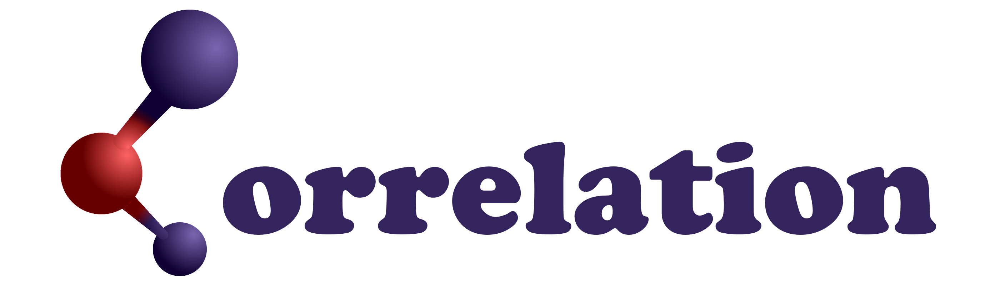

# `Correlation`: Advanced Atomistic Structural & Dynamic Analysis Suite

[](https://doi.org/10.5281/zenodo.5514113) [](https://img.shields.io/badge/version-3.9.0-green) [](https://en.cppreference.com/w/cpp/23) [](https://anaconda.org/conda-forge/correlation) [](https://img.shields.io/badge/license-AGPLv3-brightgreen) [](docs/CODE_OF_CONDUCT.md) [](https://doi.org/10.21105/joss.02976)

`Correlation` is a high-performance C++23 structural and dynamic analysis engine for atomistic simulations of **liquids, amorphous solids, crystals, disordered networks, and soft-matter systems**. 

Built for modern HPC clusters and workstations, `Correlation` delivers multi-vendor GPU acceleration (**CUDA, HIP, Intel oneAPI/SYCL**), dynamic SIMD vectorization (**AVX2, AVX-512**), multi-threaded oneTBB scaling, memory-mapped multi-gigabyte trajectory parsing, a modern Slint GUI with multi-curve comparison overlays, and direct Python/PyTorch Geometric interoperability.

---

## 📑 Table of Contents
- [`Correlation`: Advanced Atomistic Structural \& Dynamic Analysis Suite](#correlation-advanced-atomistic-structural--dynamic-analysis-suite)
  - [📑 Table of Contents](#-table-of-contents)
  - [🌟 Key Capabilities](#-key-capabilities)
    - [📊 Scientific Calculator Suite](#-scientific-calculator-suite)
    - [📂 Comprehensive Format Support](#-comprehensive-format-support)
    - [⚡ High-Performance Core \& Multi-Vendor GPU](#-high-performance-core--multi-vendor-gpu)
  - [📦 Installation](#-installation)
    - [Pre-compiled Packages](#pre-compiled-packages)
    - [Conda-Forge / Pixi](#conda-forge--pixi)
    - [Building from Source](#building-from-source)
      - [Prerequisites](#prerequisites)
      - [Step-by-Step Build](#step-by-step-build)
    - [CMake Build Options](#cmake-build-options)
  - [🚀 Usage Modes](#-usage-modes)
    - [1. Graphical User Interface (GUI)](#1-graphical-user-interface-gui)
      - [Key GUI Highlights:](#key-gui-highlights)
    - [2. Command Line Interface (CLI)](#2-command-line-interface-cli)
      - [Core CLI Arguments:](#core-cli-arguments)
    - [3. Python Bindings \& PyTorch Geometric](#3-python-bindings--pytorch-geometric)
  - [👥 Authors \& Citation](#-authors--citation)
    - [Corresponding Author](#corresponding-author)
    - [Contributors \& Co-Authors](#contributors--co-authors)
    - [Citation](#citation)
  - [📜 License](#-license)
  - [🙏 Acknowledgments](#-acknowledgments)

---

## 🌟 Key Capabilities

### 📊 Scientific Calculator Suite
`Correlation` computes an extensive array of spatial, radial, angular, topological, electronic, and dynamic properties:

| Category                        | Calculators & Functions                                                                                                                                             | Output Properties                                                                                                                     |
| :------------------------------ | :------------------------------------------------------------------------------------------------------------------------------------------------------------------ | :------------------------------------------------------------------------------------------------------------------------------------ |
| **Radial / Pair**               | **Radial Distribution Function ($J(r)$)**, **Pair Distribution Function ($g(r)$)**, **Reduced Pair Distribution ($G(r)$)**                                          | Total & partial pair correlations, coordination shells, density scaling                                                               |
| **Scattering & Diffraction**    | **Structure Factor ($S(Q) / S(K)$)**, **Powder X-ray Diffraction (XRD)**                                                                                            | Elastic scattering intensity, Faber-Ziman partials, Debye scattering equation                                                         |
| **Angular Distributions**       | **Plane-Angle Distribution (PAD)**, **Dihedral-Angle Distribution (DAD)**, **Generic Bond Angles**                                                                  | 3-body & 4-body angular configurations, tetrahedrality, dihedral orientation                                                          |
| **Topology & Local Structure**  | **Common Neighbor Analysis (CNA)**, **Coordination Numbers (CN)**, **Ring Distribution (RD)**, **Voronoi Polyhedra**, **Cluster Connectivity**, **Motif Detection** | FCC/HCP/BCC/Icosahedral classification, Voronoi index $\langle n_3, n_4, n_5, n_6 \rangle$, topological shortest-path ring statistics |
| **Order Parameters & Symmetry** | **Steinhardt Bond-Orientational Parameters ($Q_4, Q_6, W_6$)**, **Local Inversion Chirality**, **Local Excess Entropy ($s_2$)**, **Hyperuniformity Index**          | Global/local orientational order, structural chirality asymmetry, two-body excess entropy, low-$Q$ density fluctuations               |
| **Dynamics & Transport**        | **Mean Squared Displacement (MSD)**, **Velocity Autocorrelation Function (VACF)**, **Vibrational Density of States (VDOS)**                                         | Self-diffusion coefficients ($D_{MSD}, D_{VACF}$), relaxation time $\tau$, Deborah number $De$, vibrational power spectra             |
| **Spatial & Electronic / ML**   | **3D Spatial Distribution Functions (SDF)**, **Hydrogen Bonding (HBond)**, **Machine Learning Interatomic Potentials (MLIP)**                                       | 3D local coordinate voxel density, donor-acceptor geometric networks, LibTorch GNN evaluation, PyG graph construction                 |

---

### 📂 Comprehensive Format Support
Native high-speed parsing with content-based format sniffing (`ReaderFactory`) for automatic detection of extensionless or generic `.in`/`.out` files:

* **Quantum Chemistry & DFT:** **VASP** (`POSCAR`, `CONTCAR`, `XDATCAR`), **Quantum ESPRESSO** (`.pwi`, `.pwo`, `.in`, `.out`), **CP2K** (`.inp`, `.restart`, `.out`), **ORCA** (`.out`), **GPAW** (`.gpw`), **ABINIT** (`.abi`), **DFTB+** (`.gen`), **CASTEP** (`.cell`, `.md`), **ONETEP** (`.dat`), **DMol³ / Materials Studio** (`.outmol`, `.car`, `.arc`).
* **Classical Molecular Dynamics:** **LAMMPS** (`.dump`, `.lammpstrj`), **GROMACS** (`.gro`, `.xtc`, `.trr`), **CHARMM / NAMD / Amber** (`.pdb`, `.ent`).
* **Crystallography & Exchange:** **Extended XYZ** (`.xyz`, `.exyz`), **Crystallographic Information** (`.cif`).
* **Export Targets:** High-throughput tabular and binary export in **CSV**, **HDF5** (`.h5`), **Apache Arrow / Parquet** (`.parquet`), **SVG**, **PNG**, and native vector **PDF**.

---

### ⚡ High-Performance Core & Multi-Vendor GPU
* **Multi-Vendor GPU Acceleration:** Unified GPU layer supporting **NVIDIA (CUDA)**, **AMD (HIP)**, and **Intel (oneAPI / SYCL)** for $S(Q)$, pairwise distance binning, Steinhardt order parameters, and XRD Debye scattering.
* **SIMD Kernel Dispatch:** Optimized runtime vector kernels utilizing **AVX2**, **AVX-512**, and scalar fallbacks.
* **Configurable Precision (`real_t`):** Native compile-time toggle between single-precision (`float`) and double-precision (`double`) execution via `-DUSE_SINGLE_PRECISION=ON/OFF`.
* **Zero-Copy Memory-Mapped I/O:** `MappedFile` architecture allows instant lazy frame seeking across multi-gigabyte trajectories without memory exhaustion.
* **Numerical Stability:** Project-wide **Kahan compensated summation** across numerical integrals, unwrapped trajectory tracking, and Debye scattering accumulators.

---

## 📦 Installation

### Pre-compiled Packages
Download pre-built executables and installers from the [GitHub Releases](https://github.com/Isurwars/Correlation/releases) page:
* **Linux:** Portable `AppImage`, Debian/Ubuntu `.deb`, Fedora/RHEL/openSUSE `.rpm`
* **macOS:** Universal `.dmg`
* **Windows:** Standalone `.exe` installer

### Conda-Forge / Pixi
Install the CLI and Python package via `conda-forge`:
```bash
# Using Conda / Mamba
conda install -c conda-forge correlation

# Using Pixi
pixi add correlation
```

---

### Building from Source

#### Prerequisites
* **C++ Compiler:** Modern C++ compiler supporting C++23 (GCC 13+, Clang 16+, MSVC 2022+)
* **CMake:** Version 3.24 or higher
* **Ninja** or **Make**
* **Rust & Cargo:** (Required for Slint GUI compilation)
* **Intel oneTBB:** Threading Building Blocks development headers
* **Optional:** HDF5 (`libhdf5-dev`), Apache Arrow (`libarrow-dev`), FFTW3 (`libfftw3-dev`), CUDA Toolkit (12.0+) / Intel oneAPI DPC++.

#### Step-by-Step Build
```bash
# 1. Clone the repository
git clone https://github.com/Isurwars/Correlation.git
cd Correlation

# 2. Configure build with CMake
cmake -B build -G Ninja \
  -DCMAKE_BUILD_TYPE=Release \
  -DBUILD_GUI=ON \
  -DBUILD_PYTHON_BINDINGS=ON

# 3. Compile
cmake --build build -j$(nproc)

# 4. Execute test suite (700+ tests)
ctest --test-dir build --output-on-failure
```

---

### CMake Build Options

| CMake Flag                    | Default | Description                                                           |
| :---------------------------- | :------ | :-------------------------------------------------------------------- |
| `BUILD_GUI`                   | `ON`    | Compiles the Slint-based Graphical User Interface (`src/correlation`) |
| `BUILD_PYTHON_BINDINGS`       | `OFF`   | Compiles Python C-extension bindings via pybind11                     |
| `USE_SINGLE_PRECISION`        | `OFF`   | Compiles core algorithms using single-precision `float` (`real_t`)    |
| `BUILD_WITH_CUDA`             | `OFF`   | Enables NVIDIA CUDA GPU acceleration kernels                          |
| `BUILD_WITH_SYCL`             | `OFF`   | Enables Intel oneAPI / SYCL multi-vendor GPU acceleration             |
| `BUILD_WITH_HDF5`             | `OFF`   | Enables HDF5 consolidated binary export format                        |
| `BUILD_WITH_ARROW`            | `OFF`   | Enables Apache Arrow / Parquet columnar export format                 |
| `BUILD_WASM`                  | `OFF`   | Compiles WebAssembly client-side library bindings                     |
| `CORRELATION_ENABLE_LIBTORCH` | `OFF`   | Links LibTorch for native GNN MLIP evaluation                         |

---

## 🚀 Usage Modes

### 1. Graphical User Interface (GUI)
Launch the modern Slint-based interface:
```bash
./build/src/correlation
```


#### Key GUI Highlights:
* **Interactive 3-Column Layout:** Seamlessly navigate between structure setup, parameter cards, bond cutoff matrices, and live plot rendering.
* **Multi-Curve Comparison Overlay:** Load and overlay multiple datasets or trajectories simultaneously, compute dynamic difference plots ($Y_{Diff} = Y_1 - Y_2$), and customize individual styles, dashes, and color palettes.
* **Vector Publication Export:** Export high-resolution plots directly to **SVG**, **PNG**, or native **PDF** with embedded normalized vector fonts and Greek character glyphs.
* **Preset Configuration Manager:** Save and load custom analysis presets for liquid, crystalline, or amorphous simulations.

---

### 2. Command Line Interface (CLI)
Execute headlessly in automated cluster pipelines using `correlation-cli`:

```bash
# Analyze RDF, CNA, and MSD from a VASP trajectory with HDF5 and CSV output
correlation-cli Trajectory.xdatcar -o ./output/run_1 \
  --calculators RDF,CNA,MSD \
  --r-max 15.0 --r-bin 0.02 \
  --time-step 1.5 \
  --csv --hdf5
```

#### Core CLI Arguments:
| Flag                           | Parameter | Description                                                                |
| :----------------------------- | :-------- | :------------------------------------------------------------------------- |
| `-o`, `--output`               | `<path>`  | Base output path (default: input file stem)                                |
| `--calculators`                | `<list>`  | Comma-separated list of calculators to execute (e.g. `RDF,XRD,PAD,CNA`)    |
| `--r-max`, `--r-bin`           | `<float>` | Maximum radius ($Å$) and bin width ($Å$) for radial calculations           |
| `--q-max`, `--q-bin`           | `<float>` | Maximum scattering vector $Q$ ($Å^{-1}$) and bin width for $S(Q)$          |
| `--angle-bin`                  | `<float>` | Angular bin width in degrees for PAD/DAD (default: `1.0`)                  |
| `--max-ring-size`              | `<int>`   | Maximum topological ring size to evaluate (default: `8`)                   |
| `--time-step`                  | `<float>` | Simulation timestep in femtoseconds (default: `1.0`)                       |
| `--min-frame`, `--max-frame`   | `<int>`   | 1-based frame evaluation range (`-1` for all frames)                       |
| `--smoothing-kernel`           | `<str>`   | Smoothing filter: `gaussian`, `bump`, or `triweight` (default: `gaussian`) |
| `--csv`, `--hdf5`, `--parquet` |           | Toggle tabular CSV, consolidated HDF5, or Apache Parquet output            |

---

### 3. Python Bindings & PyTorch Geometric

Integrate `Correlation` directly into Python data-science environments, NumPy pipelines, and GNN frameworks:

```python
import correlation
import numpy as np

# 1. Load atomistic structure or trajectory
cell = correlation.Cell.from_file("POSCAR")

# 2. Configure structural analysis engine
df = correlation.DistributionFunctions(cell, cutoff=10.0)

# 3. Compute radial and angular distribution functions
df.calculate_rdf(r_max=12.0, bin_width=0.05)
df.calculate_pad(bin_width=1.0)

# 4. Access computed histograms and partials
gr_hist = df.get_histogram("g_r")
bins = gr_hist.bins            # NumPy float array
total_gr = gr_hist.partials["Total"]

print(f"Computed {len(bins)} bins for g(r). Peak value: {np.max(total_gr):.3f}")

# 5. Build periodic graph & convert to PyTorch Geometric Data
graph_data = correlation.build_periodic_graph(cell, cutoff=5.0)
pyg_data = correlation.to_torch_geometric(graph_data)

print(pyg_data)
# Data(pos=[N, 3], z=[N], edge_index=[2, E], edge_shift=[E, 3], edge_vec=[E, 3], cell=[3, 3], pbc=[3])
```

---

## 👥 Authors & Citation

### Corresponding Author
* **Isaías Rodríguez** — [Isurwars](https://github.com/Isurwars) <isurwars@gmail.com>

### Contributors & Co-Authors
* **Flor B. Quiroga** <quiroga.acbg@ciencias.unam.mx>
* **Renela M. Valladares** <renelavalladares@gmail.com>
* **Salvador Villarreal Lopez Rebuelta** <salvadorvillarreallr@gmail.com>
* **Alexander Valladares** <valladar@ciencias.unam.mx>
* **David Hinojosa-Romero** <david18_hr@ciencias.unam.mx>
* **Ulises Santiago**
* **Ariel A. Valladares** <valladar@unam.mx>

### Citation
If you use `Correlation` in scientific publications, please cite:
```bibtex
@article{Rodriguez2021Correlation,
  doi = {10.21105/joss.02976},
  url = {https://doi.org/10.21105/joss.02976},
  year = {2021},
  publisher = {The Open Journal},
  volume = {6},
  number = {59},
  pages = {2976},
  author = {Isa{\'i}as Rodr{\'i}guez and David Hinojosa-Romero and Alexander Valladares and Renela M. Valladares and Ariel A. Valladares},
  title = {Correlation: An Analysis Tool for Liquids and for Amorphous Solids},
  journal = {Journal of Open Source Software}
}
```

---

## 📜 License
`Correlation` is free and open-source software licensed under the **GNU Affero General Public License v3 (AGPL-3.0-only)**. See [LICENSE](LICENSE) for details.

---

## 🙏 Acknowledgments
* **I.R.** acknowledges SECIHTI and DGAPA-UNAM for postdoctoral fellowship support.
* **D.H.R.** acknowledges DGAPA-UNAM for postdoctoral fellowship support.
* **A.A.V., R.M.V., and A.V.** thank DGAPA-UNAM for continued financial support (Grant Nos. IN104617, IN116520, IN118223, and IN119226).
* **A.A.V., R.M.V., A.V., and I.R.** acknowledge SECIHTI for research project grant support (Grant No. CBF-2025-G-886).
* Simulations and benchmarks were partially conducted at the Supercomputing Center of DGTIC-UNAM and IIM-UNAM.
* Special gratitude to M. A. Carrillo, R. S. Vilchis, S. Calderón, A. de Leon, J. A. Albarran, David A. de Jesús, and A. Perez-Aguiar for testing, benchmarking structures, and feedback.
