# Correlation: Roadmap to 4.0.0
*Consolidated Strategic Plan, Completed Milestones (v3.4.x & v3.5.x), and Future Pipeline*

This document outlines the strategic direction and development roadmap for `Correlation` as we advance toward the milestone **4.0.0** release. Following the successes of the 3.x series, the roadmap focuses on solidifying core performance structures, expanding scientific format support, introducing machine learning (ML) potential descriptors, and delivering a multi-vendor GPU execution model.

---

## 🎯 Strategic Themes

```mermaid
graph TD
    classDef completed fill:#2ec4b6,stroke:#011627,stroke-width:2px,color:#fdfffc;
    classDef planned fill:#3a86c8,stroke:#011627,stroke-width:2px,color:#fdfffc;
    classDef core fill:#ff9f1c,stroke:#011627,stroke-width:2px,color:#fdfffc;

    A["Correlation 4.0.0 Vision"]:::core --> B["1. Core & Multi-Vendor GPU"]:::planned
    A --> C["2. ML & Electronic Structure"]:::planned
    A --> D["3. Widespread Format Support"]:::planned
    A --> E["4. Python Publishing & CI"]:::planned
    A --> F["5. GUI & WASM Experience"]:::planned

    B --> B1["Completed: TBB, Wigner-3j Cache, SIMD Distance"]:::completed
    B --> B2["Planned: SYCL/oneAPI, Single-Precision Path"]:::planned
    
    C --> C1["Planned: MACE/CHGNet/GAP Trajectories"]:::planned
    C --> C2["Planned: SOAP Descriptors in C++ Core"]:::planned
    
    D --> D1["Completed: Modular Reader Helpers"]:::completed
    D --> D2["Planned: ORCA, GPAW, ABINIT, DFTB+"]:::planned

    E --> E1["Completed: Lazy Frame Trajectory Indexing"]:::completed
    E --> E2["Planned: cibuildwheel PyPI Pipeline, ASE/Pymatgen Views"]:::planned

    F --> F1["Completed: Redesigned Dashboard, Native PDF, Hover Guides"]:::completed
    F --> F2["Planned: GUI Overlay Comparison, Hosted WASM App"]:::planned
```

---

## 🏆 Completed Milestones (v3.4.x & v3.5.x)

Recent iterations have addressed critical bottlenecks highlighted in the project analysis, moving several experimental optimizations directly into the stable production core.

### v3.5.x Performance & Core Enhancements
* **Wigner 3-j Symbol Caching:** Eliminated expensive recursive factorial evaluations in `SteinhardtCalculator` by precomputing and caching Wigner 3-j lookups, accelerating $W_6$ parameter calculations by approximately 100x.
* **Intel OneTBB Parallelization:** Parallelized computationally heavy loops in `CNACalculator` (migrating from recursive DFS to stack-based iterative loops) and `SteinhardtCalculator` using thread-local accumulation (`tbb::enumerable_thread_specific`) and parallel reductions.
* **SIMD Distance Optimization:** Re-engineered distance evaluations using flat cell lists and pre-allocated thread-local buffers to optimize SIMD vectorization.
* **Configurable FFT Backends:** Replaced the hand-coded Cooley-Tukey FFT with configurable support for **FFTW3** and **Intel MKL**, featuring dynamic plan caching to speed up dynamics calculations (VACF, MSD, VDOS).
* **Native PDF & Roboto Vector Rendering:** Added a high-fidelity vector drawing generator to export publication-ready PDF plots natively, integrating normalized Roboto font glyph paths.
* **Robustness & Fuzzing:** Integrated automated `libFuzzer` harnesses for all trajectory readers (CIF, GROMACS, CP2K, etc.) to enforce strict security and parsing stability in the CI/CD pipeline.
* **C++17 Compatibility:** Refactored C++20 range algorithms to C++17 equivalents to maximize cross-platform compiler support.

### v3.4.x Python & GUI Streamlining
* **Trajectory Lazy Indexing:** Implemented lazy frame indexing (`__getitem__`, `__len__`, negative indices) on Python trajectory bindings to prevent RAM exhaustion when working with large data files.
* **Extension-Based Saving:** Re-engineered GUI save dialogs to automatically configure output formats (CSV, HDF5, or Parquet) based on the user-selected file extension.
* **GUI Dashboard Consolidation:** Streamlined the Slint UI into a modern 3-column dashboard, moving settings into auto-expanded tabs and highlighting parameter bounds.

---

## 🚀 Track 1: Core & Multi-Vendor GPU Acceleration

To ensure high-performance execution across high-performance computing (HPC) centers and consumer workstations, the engine is migrating from NVIDIA-only CUDA to a unified, multi-vendor programming model.

### 1.1 CUDA Migration to Cross-Platform GPU APIs
* **Objective:** Replace CUDA-specific code with a vendor-neutral API such as **SYCL (oneAPI)**, **Kokkos**, or **Vulkan/WebGPU**.
* **Target Hardware:** Support NVIDIA, AMD, and Intel GPUs.
* **CPU Fallback:** Hardened thread-safe CPU fallbacks using TBB and SIMD.

### 1.2 Single-Precision (`float`) Compilation Path
* **Objective:** Address GPU throughput throttling on consumer cards (which often run double precision at 1:32 or 1:64 speed) and double CPU SIMD vector lane capacity.
* **Implementation:** Template all calculator classes (using a type alias `real_t` via a `USE_SINGLE_PRECISION` compile option) to support compiling in single-precision, enabling hardware Special Function Units (SFUs) for trigonometric functions.

### 1.3 Expanding GPU Acceleration Coverage
* **GPU RDF Distance Binning:** Construct a 3D cell grid on the GPU and perform parallel bin sorting (via Thrust or custom radix sort) to accelerate $O(N^2)$ pairwise distance calculations.
* **GPU XRD/Debye Calculations:** Port the Debye scattering intensity calculation to the unified GPU backend to accelerate structural diffraction evaluations.

---

## 🔬 Track 2: Machine Learning (ML) Potentials & Descriptors

As molecular simulations transition to machine learning interatomic potentials (MLIPs), `Correlation` must bridge the gap between traditional structural analysis and ML representations.

### 2.1 Trajectory Parsing for ML Potentials
* **Objective:** Support coordinates and descriptor data generated by modern ML potentials.
* **Key Targets:** Parse and analyze trajectory outputs produced by **MACE**, **CHGNet**, **GAP**, and **NequIP**.

### 2.2 SOAP Descriptors in C++ Core
* **Objective:** Implement **Smooth Overlap of Atomic Positions (SOAP)** local geometric descriptors directly inside the C++ core to provide high-speed local environment encoding without requiring external Python environments.

### 2.3 Structural-Electronic Correlation
* **Objective:** Correlate ML-predicted electronic properties (e.g., charge densities, local Fermi levels, electrostatic potentials) with geometric structures (coordination environments, Steinhardt parameters, CNA classifications).

---

## 📂 Track 3: Material Simulation Software Support

We aim to support the most widely used material simulation software packages by extending our parser suite and building a robust, structure-agnostic reader pipeline.

### 3.1 New Native Reader Integrations
* **ORCA:** Parse output logs (`.out`), orbital properties, and geometry optimization steps.
* **GPAW:** Support grid-based and projector-augmented wave trajectories (`.gpw`).
* **ABINIT:** Read output files and netCDF structure formats.
* **DFTB+:** Parse output files and coordinate files (`.gen`).

### 3.2 Enhanced Metadata Sniffing
* **Software Targets:** Extend existing VASP, GROMACS, LAMMPS, Quantum ESPRESSO, and CP2K readers to extract charge states, local forces, and energies.
* **Reader Factory Sniffing:** Improve content-based sniffing in `ReaderFactory` to handle files without extensions, resolving conflicts between generic `.in` and `.out` file types.

---

## 🐍 Track 4: Python Ecosystem & CI Automation

Python bindings make `Correlation` scriptable. In the lead-up to 4.0.0, the focus shifts to automated packaging and seamless library integration.

### 4.1 PyPI Automated Release Pipelines
* **Objective:** Set up a GitHub Actions workflow utilizing `cibuildwheel` to distribute pre-compiled binary wheels on PyPI.
* **Scope:** Provide native pre-compiled wheels across Linux, macOS, and Windows for Python versions 3.9 through 3.12+.

### 4.2 Materials Science Library Integrations
* **ASE Interoperability:** Provide fast zero-copy conversion between C++ `Cell`/`Trajectory` buffers and `ase.Atoms` objects.
* **Pymatgen Interoperability:** Expose helper utilities to instantiate C++ calculators directly using `pymatgen.core.Structure` instances.
* **Jupyter Notebook Suite:** Provide high-quality Jupyter Notebook tutorials illustrating analysis pipelines, plotting, and custom workflows.

---

## 🖥️ Track 5: GUI & WebAssembly (WASM) Experience

Improving the end-user workflow remains a high priority, particularly for researchers who prefer visual or browser-based tools.

### 5.1 Analysis Comparison Overlay (GUI)
* **Objective:** Allow users to import and overlay multiple results directly within the Slint GUI.
* **Key Features:**
  * Compare distribution curves ($g(r)$, $S(Q)$, etc.) from different frames, temperatures, or trajectory files.
  * Dynamic difference plots ($Y_{Diff} = Y_1 - Y_2$) with custom styling.
  * Export comparison plots directly as SVG/PDF/PNG images.

### 5.2 Hosted Standalone WASM Web Application
* **Objective:** Deploy a client-side version of the C++ engine to the web via WebAssembly (`-DBUILD_WASM=ON`).
* **Implementation:**
  * Host a client-side static web application on GitHub Pages.
  * Allow users to upload coordinates (e.g. `POSCAR`, `.xyz`, `.pdb`) and calculate properties (RDF, PAD) completely client-side in the browser.
  * Optimize WebAssembly footprint utilizing **WASM SIMD128** intrinsics and multi-threaded Web Workers.

---

## 📐 Numerical Precision & Stability Pipeline

To prevent floating-point drift, cancellations, and rounding accumulation in large physics simulations, the following precision protocols will be integrated:

### 6.1 Double-Precision Accumulation for Unwrapped Trajectories
* **Problem:** In mean squared displacement (MSD) calculations, accumulating coordinates frame-by-frame leads to cumulative rounding errors over long simulations.
* **Solution:** Maintain unwrapped coordinates using **double-precision accumulation** (or Kahan compensated summation) even when the trajectory positions are compiled in single precision.

### 6.2 Compensated Summation for Large Debye/XRD Integrations
* **Problem:** Summing thousands of small contributions into a single accumulator in Debye scattering and XRD calculations truncates lower-order bits.
* **Solution:** Implement **Kahan compensated summation** or recursive **pairwise summation** (using divide-and-conquer TBB reductions) to preserve floating-point accuracy.

---

## 📅 Timeline & Milestones to 4.0.0

| Milestone / Version | Target Date | Focus Area | Key Deliverables |
| :--- | :--- | :--- | :--- |
| **v3.6.0** | **Q3 2026** | **Python Wheels & GUI Overlay** | • PyPI release pipeline via `cibuildwheel` • Slint GUI Comparison & Overlay Panel • Jupyter Notebook tutorial suite |
| **v3.7.0** | **Q3 - Q4 2026** | **GPU Migration & Precision** | • SYCL/oneAPI multi-vendor GPU migration • Single-precision (`real_t`) compile path • Kahan/Compensated summation integration |
| **v3.8.0** | **Q4 2026** | **ML Potentials & Format Expansion** | • MACE, CHGNet, GAP trajectory readers • Native C++ SOAP descriptors • ORCA, GPAW, ABINIT, and DFTB+ readers |
| **v4.0.0** | **Q1 2027** | **WASM App & GPU expansion** | • Public hosted WASM Web App (SIMD128 + Workers) • GPU-accelerated RDF binning & XRD • Stable 4.0.0 API release |

---

## 📈 Long-Term Vision (2027+)
Looking beyond 4.0.0, the roadmap lays the foundation for:
1. **Interactive 3D Structure Viewer** integrated directly into the GUI.
2. **Real-time Simulation Monitoring** by streaming trajectories over IPC/TCP sockets.
3. **Advanced Topological Analysis** such as Persistent Homology (PH) and machine learning classification of disordered networks.
