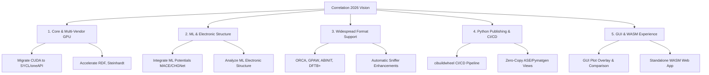

# Correlation: 2026 Roadmap
*Working Plan for the Rest of 2026*

This document outlines the strategic direction and working plan for `Correlation` during the remainder of 2026. Following the successful release of version `3.0`, the focus shifts toward expanding the scientific capabilities of the engine, migrating core performance structures to support multi-vendor GPU environments, and integrating with modern machine learning (ML) frameworks.

---

## 🎯 Core Themes for 2026

---

## 🚀 Track 1: Core & Multi-Vendor GPU Acceleration

To ensure maximum accessibility and performance across high-performance computing (HPC) centers and consumer hardware, the GPU acceleration engine will be migrated from NVIDIA-only CUDA to a unified, multi-vendor programming model.

### 1.1 Migration from CUDA to Cross-Platform GPU APIs
* **Objective:** Replace CUDA-specific code with a vendor-neutral API such as **SYCL (oneAPI)**, **Kokkos**, or **Vulkan/WebGPU**.
* **Target Platforms:** Support NVIDIA, AMD (ATI), and Intel GPUs seamlessly.
* **Fallback Guarantee:** Maintain and harden the robust automatic CPU fallback pathway when no compatible GPU driver or runtime is present.

### 1.2 Expanding GPU Acceleration Coverage
* **Target Calculators:** Port performance-critical radial distribution functions (RDF) and computationally expensive Steinhardt bond-orientational parameters ($Q_4, Q_6$) to the new unified GPU backend.
* **Benchmarking:** Integrate GPU benchmarks into the automated suite to measure performance scaling across hardware generations.

---

## 🔬 Track 2: Machine Learning (ML) Potentials & Electronic Structure

The rise of machine learning in molecular simulations requires `Correlation` to bridge the gap between traditional atomistic analyses and modern ML-driven structural representations.

### 2.1 Machine Learning Interatomic Potentials (MLIPs)
* **Objective:** Support structures and descriptor data generated by state-of-the-art ML potentials of 2026.
* **Key Targets:** 
  * Parse and analyze trajectories produced by **MACE**, **CHGNet**, **GAP**, and **NequIP**.
  * Compute and project structural analysis metrics (e.g., coordinate distribution, coordination number) onto ML-derived local atomic environments.
  * Implement calculations for local geometric descriptors (such as Smooth Overlap of Atomic Positions - SOAP) directly inside the C++ core.

### 2.2 Machine Learning Electronic Structure Integration
* **Objective:** Parse and visualize electronic properties predicted by machine learning models or hybrid ML/DFT workflows.
* **Key Features:**
  * Support for ML-predicted electronic density of states (e.g., charge densities, electrostatic potentials).
  * Direct structural-electronic correlations (e.g., mapping band gaps or local Fermi levels to coordination environments or Steinhardt parameters).

---

## 📂 Track 3: Widespread Material Simulation Software Support

We aim to support the most widely used material simulation software packages of 2026. This requires extending our parser suite and building a robust, structure-agnostic reader pipeline.

### 3.1 New Parser Integrations
We will add native readers for the following tools:
* **ORCA:** Parse output logs (`.out`), orbital properties, and geometry optimization steps.
* **GPAW:** Support grid-based and projector-augmented wave trajectories (`.gpw`).
* **ABINIT:** Read output files and netCDF structure formats.
* **DFTB+:** Parse `.out` files and coordinate files (`.gen`).

### 3.2 Enhanced Parser Suite & Meta-Data Sniffing
* **Software Targets:** Extend existing parsers for **VASP**, **GROMACS**, **LAMMPS**, **Quantum ESPRESSO**, and **CP2K** to extract additional context (charge states, dipole moments, local forces, and energies).
* **Reader Factory Sniffing:** Improve content-based sniffing in `ReaderFactory` to handle files without extensions, resolving conflicts between generic `.in` and `.out` extensions.

---

## 🐍 Track 4: Python Ecosystem & CI/CD Release Automation

Python bindings make `Correlation` scriptable. In late 2026, we will focus on packaging, publication automation, and seamless library integration.

### 4.1 PyPI Automated Release Pipelines (CI/CD)
* **Objective:** Create a automated GitHub Actions workflow to publish pre-compiled Python wheels to PyPI.
* **Implementation:**
  * Configure `cibuildwheel` to automatically build binary wheels across Linux, macOS, and Windows.
  * Deliver support for multiple Python versions (3.9 through 3.12+).
  * Enable automatic publishing on GitHub releases/tags.

### 4.2 Material Science Library Integrations
* **Objective:** Provide direct interoperability with Python's scientific ecosystem.
* **Interoperability Targets:**
  * **ASE (Atomic Simulation Environment):** Fast zero-copy conversion between C++ `Cell`/`Trajectory` buffers and `ase.Atoms` objects.
  * **Pymatgen:** Expose utilities to easily instantiate `Correlation` calculators using `pymatgen.core.Structure` structures.
  * **Documentation:** Provide high-quality Jupyter Notebook tutorials illustrating analysis pipelines, plotting, and custom pipeline workflows.

---

## 🖥️ Track 5: GUI & Web Assembly (WASM) Experience

Improving the end-user workflow remains a high priority, particularly for researchers who prefer visual or browser-based tools.

### 5.1 Analysis Comparison Overlay (GUI)
* **Objective:** Allow users to import and overlay multiple results directly within the Slint GUI.
* **Key Features:**
  * Compare distribution curves ($g(r)$, $S(Q)$, etc.) from different frames, temperatures, or trajectory files.
  * Dynamic difference plots ($Y_{Diff} = Y_1 - Y_2$) with custom styling.
  * Export comparison plots directly as SVG/PNG images.

### 5.2 Hosted Standalone WASM Web Application
* **Objective:** Deploy a client-side version of the C++ engine to the web via WebAssembly (`-DBUILD_WASM=ON`).
* **Implementation:**
  * Set up a web interface hosted on GitHub Pages.
  * Allow users to upload coordinates (e.g. `POSCAR`, `.xyz`, `.pdb`) and calculate properties (RDF, PAD) completely client-side in the browser.
  * Minimize WASM bundle size and leverage multithreading via Web Workers where browser-supported.

---

## 📅 Timeline & Milestones (2026)

| Milestone / Quarter              | Focus Area                           | Deliverables                                                                                                                                               |
| :------------------------------- | :----------------------------------- | :--------------------------------------------------------------------------------------------------------------------------------------------------------- |
| **Q2 - Q3 2026** (June - August) | **Python CI & GUI Comparison**       | • PyPI release pipeline via `cibuildwheel`   • Overlay & Comparison panel in the Slint GUI   • Jupyter Notebook tutorial suite                       |
| **Q3 - Q4 2026** (Sept - Oct)    | **GPU Migration & Format Expansion** | • Migrate CUDA to cross-platform GPU APIs (SYCL/oneAPI)   • Add ORCA, GPAW, ABINIT, and DFTB+ readers   • Zero-copy ASE & Pymatgen views             |
| **Q4 2026** (Nov - Dec)          | **ML Potentials & WASM Release**     | • Integrate MACE, CHGNet, and electronic structure ML models   • Deploy the hosted WASM web application   • Expand GPU support to RDF and Steinhardt |

---

## 📈 Long-Term Vision (2027+)
Looking beyond 2026, the roadmap lays the foundation for:
1. **Interactive 3D Structure Viewer** integrated directly into the GUI.
2. **Real-time Simulation Monitoring** by streaming trajectories over IPC/TCP sockets.
3. **Advanced Topological Analysis** such as Persistent Homology (PH) and machine learning classification of disordered networks.
