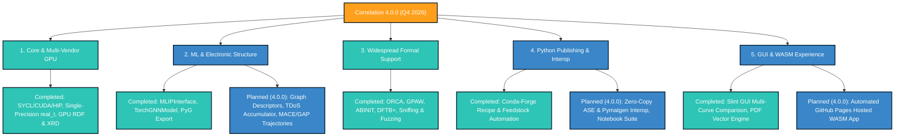

# Correlation: Roadmap to 4.0.0
*Consolidated Strategic Plan, Completed Milestones (v3.4.x – v3.9.0), and Target 4.0.0 Release (Q4 2026)*

This document outlines the strategic direction and development roadmap for `Correlation` as we advance toward the milestone **4.0.0** release targeted for **Q4 2026**. Following the rapid delivery of the 3.x series through **v3.9.0** (August 2026), the remaining roadmap focuses on completing native graph descriptors, integrating the Total Density of States (TDoS) accumulator from GNN electronic structure predictions, finalizing zero-copy Python bridges (ASE/Pymatgen), and automating the public deployment of the web-native WASM application.

---

## 🎯 Strategic Themes

```mermaid
graph TD
    classDef completed fill:#2ec4b6,stroke:#011627,stroke-width:2px,color:#fdfffc;
    classDef planned fill:#3a86c8,stroke:#011627,stroke-width:2px,color:#fdfffc;
    classDef core fill:#ff9f1c,stroke:#011627,stroke-width:2px,color:#fdfffc;

    A["Correlation 4.0.0 (Q4 2026)"]:::core --> B["1. Core & Multi-Vendor GPU"]:::completed
    A --> C["2. ML & Electronic Structure"]:::planned
    A --> D["3. Widespread Format Support"]:::completed
    A --> E["4. Python Publishing & Interop"]:::planned
    A --> F["5. GUI & WASM Experience"]:::planned

    B --> B1["Completed: SYCL/CUDA/HIP, Single-Precision real_t, GPU RDF & XRD"]:::completed
    
    C --> C1["Completed: MLIPInterface, TorchGNNModel, PyG Export"]:::completed
    C --> C2["Planned (4.0.0): Graph Descriptors, TDoS Accumulator, MACE/GAP Trajectories"]:::planned
    
    D --> D1["Completed: ORCA, GPAW, ABINIT, DFTB+, Sniffing & Fuzzing"]:::completed

    E --> E1["Completed: Conda-Forge Recipe & Feedstock Automation"]:::completed
    E --> E2["Planned (4.0.0): Zero-Copy ASE & Pymatgen Interop, Notebook Suite"]:::planned

    F --> F1["Completed: Slint GUI Multi-Curve Comparison, PDF Vector Engine"]:::completed
    F --> F2["Planned (4.0.0): Automated GitHub Pages Hosted WASM App"]:::planned
```

---

## 🏆 Completed Milestones (v3.4.x – v3.9.0)

Recent release cycles have moved major core acceleration frameworks, cross-platform GPU APIs, quantum simulation parsers, precision controls, and machine learning interfaces into the production codebase.

### v3.9.0 Multi-Curve Comparison, Quantum Readers & GPU Scattering (August 2026)
* **GUI Multi-Curve Comparison Overlay & Residuals:** Implemented multi-curve overlay, interactive difference plots ($Y_{Diff} = Y_1 - Y_2$), and synchronized SVG/PDF/PNG comparison export engines in `PlotController`, `SvgComparisonRenderer`, and `PdfComparisonRenderer`.
* **Quantum Simulation Reader Suite:** Added native trajectory and structure readers for **ORCA** (`.out`), **GPAW** (`.gpw`), **ABINIT** (`.abi`), and **DFTB+** (`.gen`).
* **Automated Format Sniffing:** Implemented content-based file sniffing in `ReaderFactory` to disambiguate `.out`, `.in`, and generic quantum chemistry restart outputs.
* **GPU-Accelerated XRD & Debye Scattering:** Delivered unified CUDA and SYCL/oneAPI kernels (`GPUXRDCalculator`, `SYCLXRDCalculator`) for parallel diffraction pattern calculations.
* **GPU RDF 3D Cell Grid Binning:** Implemented 3D spatial search grids and bin sorting (`GPUSearchGrid`, `GPUBinData`) in `GPUDistanceCalculator.cu`.
* **PyTorch Geometric (PyG) Integration:** Added `to_torch_geometric` / `to_pyg` adapters to export `PeriodicGraphData` directly into PyG `Data` tensors.
* **Precision Stability Gates:** Integrated `KahanAccumulator` across unwrapped MSD displacement tracking and XRD intensity summations.

### v3.7.0 Multi-Vendor GPU, Precision & MLIP Architecture (July 2026)
* **Multi-Vendor GPU Acceleration Framework:** Implemented SYCL-based GPU acceleration (`GPUDistanceCalculator`, `GPUSQCalculator`, `GPUSteinhardtCalculator`) with runtime fallback and hardware device detection. Added `GPUPortability` layer featuring unified HIP and CUDA compatibility wrappers.
* **Configurable Floating-Point Precision:** Replaced hardcoded `double` precision with a project-wide `real_t` type alias across all calculators, readers, plotters, and test suites, enabling compile-time single (`float`) or double (`double`) precision builds via `-DUSE_SINGLE_PRECISION=ON/OFF`.
* **Machine Learning Interatomic Potentials (MLIP):** Integrated `MLIPCalculator` and `MLIPInterface` abstractions alongside `TorchGNNModel` and `PeriodicGraphBuilder` for evaluating ML-predicted potential energy surfaces, forces, and electronic states.
* **Modular SIMD Acceleration Framework:** Introduced dynamic SIMD vectorization with AVX2, AVX512, and scalar fallbacks, including vectorized `dot_block` kernels and templatized `Vector3SIMD`.
* **Parameter Struct Standardization:** Standardized calculator call interfaces (`ScaleBinsParams`, `VDOSParams`, `RDFNormalizationParams`) for type-safe dispatch and maintainability.
* **Codebase Modernization & Zero-NOLINT Compliance:** Migrated standard to C++23 (`CMAKE_CXX_STANDARD 23`), replaced `reinterpret_cast` with `std::bit_cast`, standardized PRNG seeding, and completely eliminated all `NOLINT`/`NOLINTNEXTLINE` inline suppressions.

### v3.6.x Slint UI Modernization & Precision Refactoring (July 2026)
* **Greek Vector Font Glyphs:** Integrated complete high-fidelity vector glyph paths for all uppercase (`0x0391`-`0x03AA`) and lowercase (`0x03B1`-`0x03CA`) Greek characters from NotoSans into the custom Roboto vector rendering engine.
* **Slint Material Components:** Created shared, style-consistent `TabItem` and `OptionsCard` container components, streamlining UI state synchronization and options tab management.
* **Kahan Summation Precision:** Applied Kahan compensated summation across mathematical utilities and accumulators to eliminate floating-point drift.
* **Automated Package Distribution:** Integrated Conda-Forge feedstock and recipe infrastructure.

### v3.5.x Performance & Core Enhancements
* **Wigner 3-j Symbol Caching:** Eliminated expensive recursive factorial evaluations in `SteinhardtCalculator` by precomputing and caching Wigner 3-j lookups, accelerating $W_6$ parameter calculations by approximately 100x.
* **Intel OneTBB Parallelization:** Parallelized CNA (migrating from recursive DFS to stack-based iterative loops) and Steinhardt calculators using thread-local accumulation (`tbb::enumerable_thread_specific`) and parallel reductions.
* **SIMD Distance Optimization:** Re-engineered distance evaluations using flat cell lists and pre-allocated thread-local buffers to optimize SIMD vectorization.
* **Configurable FFT Backends:** Replaced the hand-coded Cooley-Tukey FFT with configurable support for **FFTW3** and **Intel MKL**, featuring dynamic plan caching for dynamics calculations (VACF, MSD, VDOS).
* **Native PDF & Roboto Vector Rendering:** Added a high-fidelity vector drawing generator to export publication-ready PDF plots natively, integrating normalized Roboto font glyph paths.
* **Robustness & Fuzzing:** Integrated automated `libFuzzer` harnesses for all trajectory readers in the CI/CD pipeline.

### v3.4.x Python & GUI Streamlining
* **Trajectory Lazy Indexing:** Implemented lazy frame indexing (`__getitem__`, `__len__`, negative indices) on Python trajectory bindings to prevent RAM exhaustion when working with large data files.
* **Extension-Based Saving:** Re-engineered GUI save dialogs to automatically configure output formats (CSV, HDF5, or Parquet) based on user-selected file extensions.
* **GUI Dashboard Consolidation:** Streamlined the Slint UI into a modern 3-column dashboard layout.

---

## 🚀 Track 1: Core & Multi-Vendor GPU Acceleration

*All key deliverables under Track 1 have been completed in v3.7.0 – v3.9.0.*

### 1.1 Cross-Platform GPU Execution (Completed)
* **Status:** Delivered.
* **Implementation:** `SYCLDistanceCalculator`, `SYCLSQCalculator`, `SYCLXRDCalculator`, `GPUXRDCalculator`, `GPUSteinhardtCalculator`, and `GPUPortability` abstraction supporting NVIDIA (CUDA), AMD (HIP), and Intel (oneAPI/SYCL) hardware with automatic CPU TBB fallback.

### 1.2 Configurable Floating-Point Precision (`real_t`) (Completed)
* **Status:** Delivered.
* **Implementation:** Templated calculator kernels and readers via `real_t` (controlled via `USE_SINGLE_PRECISION`), enabling hardware Special Function Units (SFUs) for single-precision trigonometric evaluation.

### 1.3 Expanded GPU Acceleration Coverage (Completed)
* **GPU RDF Distance Binning:** 3D cell grid and bin sorting delivered in `GPUDistanceCalculator.cu`.
* **GPU XRD/Debye Calculations:** Unified CUDA and SYCL Debye scattering intensity kernels delivered in `GPUXRDCalculator.cu` and `SYCLXRDCalculator.cpp`.

---

## 🔬 Track 2: Machine Learning (ML) Potentials & Electronic Structure

As molecular simulations transition to machine learning interatomic potentials (MLIPs), `Correlation` bridges traditional structural analysis, graph neural networks (GNNs), and electronic structure representations.

### 2.1 Trajectory Parsing for ML Potentials (Target: 4.0.0 / Q4 2026)
* **Objective:** Support multi-property coordinates, forces, and virial tensors generated by modern ML potential trajectories.
* **Key Targets:** Specialized trajectory and energy/force log extractors for **MACE**, **CHGNet**, **GAP**, and **NequIP**.

### 2.2 Periodic Graph Descriptors in C++ Core (Target: 4.0.0 / Q4 2026)
* **Objective:** Expand the native C++ periodic graph construction pipeline (`PeriodicGraphBuilder`) to compute equivariant geometric and topological graph descriptors (edge displacement vectors, periodic shift indices, radial Bessel embeddings, and spherical harmonics features) directly for fast GNN inference without external Python overhead.

### 2.3 Structural-Electronic Correlation & Total DOS Accumulator (Target: 4.0.0 / Q4 2026)
* **Objective:** Correlate ML/GNN-predicted electronic properties with geometric structures (coordination environments, Steinhardt parameters, CNA classifications).
* **LDoS & Total DOS (TDoS) Accumulation:** In MLIP electronic structure models (such as the Cellulose GNN project) that predict per-atom Local Density of States (LDoS), implement high-performance C++ accumulators to integrate, project, and compute the **Total Density of States (TDoS)** across trajectories and specific structural coordination motifs.

---

## 📂 Track 3: Material Simulation Software Support

*Native reader integrations and sniffing have been completed in v3.8.0 – v3.9.0.*

### 3.1 Native Reader Integrations (Completed)
* **ORCA:** Output logs (`.out`), orbital properties, and geometry optimization steps (`OrcaReader`).
* **GPAW:** Grid-based and projector-augmented wave structures (`GpawReader`).
* **ABINIT:** Output files and coordinate representations (`AbinitReader`).
* **DFTB+:** Output files and coordinate files (`.gen`, `DftbReader`).

### 3.2 Metadata Sniffing & Robustness (Completed)
* **Reader Factory Sniffing:** Automated content sniffing in `ReaderFactory` for `.out`, `.in`, `.restart`, `.pwo`, `.orca`, `.gpaw`, `.abi`, and `.gen` files.

---

## 🐍 Track 4: Python Ecosystem & CI Automation

Python bindings make `Correlation` scriptable. Focus for 4.0.0 centers on zero-copy materials science ecosystem bridges.

### 4.1 Conda-Forge Package Distribution (Completed)
* **Status:** Completed.
* **Implementation:** Source-controlled `recipe/meta.yaml`, `build.sh`, and `bld.bat` for automated cross-platform packaging on `conda-forge`.

### 4.2 Materials Science Library Integrations (Target: 4.0.0 / Q4 2026)
* **ASE Interoperability:** Provide fast zero-copy conversion between C++ `Cell`/`Trajectory` buffers and `ase.Atoms` objects (`from_ase`, `to_ase`).
* **Pymatgen Interoperability:** Expose helper utilities to instantiate C++ calculators directly using `pymatgen.core.Structure` instances (`from_pymatgen`, `to_pymatgen`).
* **Jupyter Notebook Suite:** Deliver comprehensive Jupyter Notebook tutorials demonstrating analysis pipelines, electronic structure correlation, and plotting.

---

## 🖥️ Track 5: GUI & WebAssembly (WASM) Experience

### 5.1 Analysis Comparison Overlay (GUI) (Completed in v3.9.0)
* **Status:** Delivered.
* **Implementation:** Slint GUI multi-curve overlay, residual difference plots ($Y_{Diff} = Y_1 - Y_2$), and unified SVG/PDF/PNG export via `SvgComparisonRenderer` and `PdfComparisonRenderer`.

### 5.2 Hosted Standalone WASM Web Application (Target: 4.0.0 / Q4 2026)
* **Objective:** Deploy the client-side C++ engine to the web via WebAssembly (`-DBUILD_WASM=ON`).
* **Implementation:**
  * Automate GitHub Actions CI deployment of `ui/wasm_app/` to GitHub Pages.
  * Optimize WebAssembly binaries utilizing **WASM SIMD128** intrinsics and multi-threaded Web Workers.

---

## 📐 Numerical Precision & Stability Pipeline

*All precision and accumulation milestones have been completed in v3.6.0 – v3.9.0.*

### 6.1 Kahan Compensated Summation (Completed)
* **Status:** Delivered via `KahanAccumulator` in `SIMDUtils.hpp`.

### 6.2 Double-Precision Accumulation for Unwrapped Trajectories (Completed)
* **Status:** Delivered. `DynamicsAnalyzer.cpp` uses Kahan summation on minimum-image displacement accumulation during MSD unwrapping.

### 6.3 Compensated Summation for Large Debye/XRD Integrations (Completed)
* **Status:** Delivered. `XRDCalculator.cpp` integrates `KahanAccumulator` across angular intensity summations.

---

## 📅 Timeline & Milestones to 4.0.0

| Milestone / Version | Target Date | Focus Area | Key Deliverables |
| :--- | :--- | :--- | :--- |
| **v3.7.0** | **Completed (Jul 2026)** | **Multi-Vendor GPU & Precision** | • SYCL/oneAPI & CUDA/HIP GPU acceleration • Configurable `real_t` single-precision path • `MLIPCalculator` interface & SIMD vectorization |
| **v3.9.0** | **Completed (Aug 2026)** | **Comparison, Readers & GPU XRD** | • Slint GUI multi-curve overlay & difference plots • ORCA, GPAW, ABINIT, and DFTB+ readers • Content-based `ReaderFactory` sniffing • GPU XRD/Debye & GPU RDF cell binning • PyG (`to_torch_geometric`) GNN export • Kahan-compensated unwrapped MSD & XRD |
| **v4.0.0** | **Target: Q4 2026** | **MLIP GNN, Python Bridges & WASM** | • Periodic graph descriptors & edge-feature embeddings • Structural-Electronic correlation & Total DOS (TDoS) accumulator (Cellulose project) • MACE, CHGNet, GAP trajectory parsers • Zero-copy ASE & Pymatgen Python bindings • Automated GitHub Pages deployment for WASM Web App • End-to-end Jupyter Notebook tutorial suite • Stable 4.0.0 API freeze |

---

## 📈 Long-Term Vision (2027+)

Looking beyond 4.0.0, the roadmap lays the foundation for:
1. **Interactive 3D Structure Viewer** integrated directly into the GUI.
2. **Real-time Simulation Monitoring** by streaming trajectories over IPC/TCP sockets.
3. **Advanced Topological Analysis** such as Persistent Homology (PH) and machine learning classification of disordered networks.
