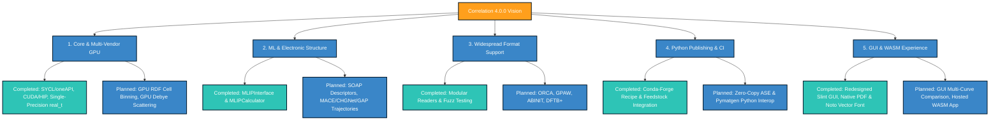

# Correlation: Roadmap to 4.0.0
*Consolidated Strategic Plan, Completed Milestones (v3.4.x – v3.7.x), and Future Pipeline (v3.8.0, v3.9.0, v4.0.0)*

This document outlines the strategic direction and development roadmap for `Correlation` as we advance toward the milestone **4.0.0** release. Following the successes of the 3.x series, the roadmap focuses on solidifying core performance structures, expanding scientific format support, introducing machine learning (ML) potential descriptors, delivering a multi-vendor GPU execution model, and deploying a web-native application framework.

---

## 🎯 Strategic Themes

```mermaid
graph TD
    classDef completed fill:#2ec4b6,stroke:#011627,stroke-width:2px,color:#fdfffc;
    classDef planned fill:#3a86c8,stroke:#011627,stroke-width:2px,color:#fdfffc;
    classDef core fill:#ff9f1c,stroke:#011627,stroke-width:2px,color:#fdfffc;

    A["Correlation 4.0.0 Vision"]:::core --> B["1. Core & Multi-Vendor GPU"]:::planned
    A --> C["2. ML & Electronic Structure"]:::planned
    A --> D["3. Widespread Format Support"]:::planned
    A --> E["4. Python Publishing & CI"]:::planned
    A --> F["5. GUI & WASM Experience"]:::planned

    B --> B1["Completed: SYCL/oneAPI, CUDA/HIP, Single-Precision real_t"]:::completed
    B --> B2["Planned: GPU RDF Cell Binning, GPU Debye Scattering"]:::planned
    
    C --> C1["Completed: MLIPInterface & MLIPCalculator"]:::completed
    C --> C2["Planned: SOAP Descriptors, MACE/CHGNet/GAP Trajectories"]:::planned
    
    D --> D1["Completed: Modular Readers & Fuzz Testing"]:::completed
    D --> D2["Planned: ORCA, GPAW, ABINIT, DFTB+"]:::planned

    E --> E1["Completed: Conda-Forge Recipe & Feedstock Integration"]:::completed
    E --> E2["Planned: Zero-Copy ASE & Pymatgen Python Interop"]:::planned

    F --> F1["Completed: Redesigned Slint GUI, Native PDF & Noto Vector Font"]:::completed
    F --> F2["Planned: GUI Multi-Curve Comparison, Hosted WASM App"]:::planned
```

---

## 🏆 Completed Milestones (v3.4.x – v3.7.x)

Recent releases have moved major core acceleration frameworks, cross-platform GPU APIs, floating-point precision controls, and machine learning interfaces into the production codebase.

### v3.7.0 Multi-Vendor GPU, Precision & MLIP Architecture
* **Multi-Vendor GPU Acceleration Framework:** Implemented SYCL-based GPU acceleration (`GPUDistanceCalculator`, `GPUSQCalculator`, `GPUSteinhardtCalculator`) with runtime fallback and hardware device detection. Added `GPUPortability` layer featuring unified HIP and CUDA compatibility wrappers.
* **Configurable Floating-Point Precision:** Replaced hardcoded `double` precision with a project-wide `real_t` type alias across all calculators, readers, plotters, and test suites, enabling compile-time single (`float`) or double (`double`) precision builds via `-DUSE_SINGLE_PRECISION=ON/OFF`.
* **Machine Learning Interatomic Potentials (MLIP):** Integrated `MLIPCalculator` and `MLIPInterface` abstractions for evaluating ML-predicted potential energy surfaces and forces.
* **Modular SIMD Acceleration Framework:** Introduced dynamic SIMD vectorization with AVX2, AVX512, and scalar fallbacks, including vectorized `dot_block` kernels and templatized `Vector3SIMD`.
* **Parameter Struct Standardization:** Standardized calculator call interfaces (`ScaleBinsParams`, `VDOSParams`, `RDFNormalizationParams`) for type-safe dispatch and maintainability.
* **Codebase Modernization & Zero-NOLINT Compliance:** Migrated standard to C++23 (`CMAKE_CXX_STANDARD 23`), replaced `reinterpret_cast` with `std::bit_cast`, standardized PRNG seeding, and completely eliminated all `NOLINT`/`NOLINTNEXTLINE` inline suppressions.
* **PyPI Wheel Repair Automation:** Created `repair_wheel.py` helper script to automate oneTBB dependency vendoring and rpath patching for Linux, macOS, and Windows wheel releases.

### v3.6.x Slint UI Modernization & Precision Refactoring
* **Greek Vector Font Glyphs:** Integrated complete high-fidelity vector glyph paths for all uppercase (`0x0391`-`0x03AA`) and lowercase (`0x03B1`-`0x03CA`) Greek characters from NotoSans into the custom Roboto vector rendering engine.
* **Slint Material Components:** Created shared, style-consistent `TabItem` and `OptionsCard` container components, streamlining UI state synchronization and options tab management.
* **Kahan Summation Precision:** Applied Kahan compensated summation across mathematical utilities and accumulators to eliminate floating-point drift.
* **Automated PyPI Publishing:** Integrated CI/CD workflows for building and publishing Python source distributions and wheels to PyPI.

### v3.5.x Performance & Core Enhancements
* **Wigner 3-j Symbol Caching:** Eliminated expensive recursive factorial evaluations in `SteinhardtCalculator` by precomputing and caching Wigner 3-j lookups, accelerating $W_6$ parameter calculations by approximately 100x.
* **Intel OneTBB Parallelization:** Parallelized CNA (migrating from recursive DFS to stack-based iterative loops) and Steinhardt calculators using thread-local accumulation (`tbb::enumerable_thread_specific`) and parallel reductions.
* **SIMD Distance Optimization:** Re-engineered distance evaluations using flat cell lists and pre-allocated thread-local buffers to optimize SIMD vectorization.
* **Configurable FFT Backends:** Replaced the hand-coded Cooley-Tukey FFT with configurable support for **FFTW3** and **Intel MKL**, featuring dynamic plan caching for dynamics calculations (VACF, MSD, VDOS).
* **Native PDF & Roboto Vector Rendering:** Added a high-fidelity vector drawing generator to export publication-ready PDF plots natively, integrating normalized Roboto font glyph paths.
* **Robustness & Fuzzing:** Integrated automated `libFuzzer` harnesses for all trajectory readers in the CI/CD pipeline.

### v3.4.x Python & GUI Streamlining
* **Trajectory Lazy Indexing:** Implemented lazy frame indexing (`__getitem__`, `__len__`, negative indices) on Python trajectory bindings to prevent RAM exhaustion when working with large data files.
* **Extension-Based Saving:** Re-engineered GUI save dialogs to automatically configure output formats (CSV, HDF5, or Parquet) based on user-selected file extensions.
* **GUI Dashboard Consolidation:** Streamlined the Slint UI into a modern 3-column dashboard layout.

---

## 🚀 Track 1: Core & Multi-Vendor GPU Acceleration

To ensure high-performance execution across high-performance computing (HPC) centers and consumer workstations, the core engine supports multi-vendor GPU APIs alongside thread-safe SIMD CPU acceleration.

### 1.1 Cross-Platform GPU Execution (Delivered in 3.7.0)
* **Status:** Delivered.
* **Implementation:** `SYCLDistanceCalculator`, `SYCLSQCalculator`, and `GPUPortability` abstraction supporting NVIDIA (CUDA), AMD (HIP), and Intel (oneAPI/SYCL) hardware with automatic CPU TBB fallback.

### 1.2 Configurable Floating-Point Precision (`real_t`) (Delivered in 3.7.0)
* **Status:** Delivered.
* **Implementation:** Templated calculator kernels and readers via `real_t` (controlled via `USE_SINGLE_PRECISION`), enabling hardware Special Function Units (SFUs) for single-precision trigonometric evaluation.

### 1.3 Expanding GPU Acceleration Coverage (Planned for 4.0.0)
* **GPU RDF Distance Binning:** Construct a 3D cell grid on the GPU and perform parallel radix sorting to accelerate $O(N^2)$ pairwise distance calculations.
* **GPU XRD/Debye Calculations:** Port the Debye scattering intensity calculation to the unified GPU backend to accelerate structural diffraction evaluations.

---

## 🔬 Track 2: Machine Learning (ML) Potentials & Descriptors

As molecular simulations transition to machine learning interatomic potentials (MLIPs), `Correlation` bridges traditional structural analysis and ML representations.

### 2.1 Trajectory Parsing for ML Potentials (Planned for 3.8.0)
* **Objective:** Support coordinates, forces, and descriptor data generated by modern ML potentials.
* **Key Targets:** Parse and analyze trajectory outputs produced by **MACE**, **CHGNet**, **GAP**, and **NequIP**.

### 2.2 SOAP Descriptors in C++ Core (Planned for 3.8.0)
* **Objective:** Implement **Smooth Overlap of Atomic Positions (SOAP)** local geometric descriptors directly inside the C++ core to provide high-speed local environment encoding without requiring external Python environments.

### 2.3 Structural-Electronic Correlation (Planned for 3.9.0)
* **Objective:** Correlate ML-predicted electronic properties (e.g., charge densities, local Fermi levels, electrostatic potentials) with geometric structures (coordination environments, Steinhardt parameters, CNA classifications).

---

## 📂 Track 3: Material Simulation Software Support

We aim to support the most widely used material simulation software packages by extending our parser suite and building a robust, structure-agnostic reader pipeline.

### 3.1 New Native Reader Integrations (Planned for 3.8.0)
* **ORCA:** Parse output logs (`.out`), orbital properties, and geometry optimization steps.
* **GPAW:** Support grid-based and projector-augmented wave trajectories (`.gpw`).
* **ABINIT:** Read output files and netCDF structure formats.
* **DFTB+:** Parse output files and coordinate files (`.gen`).

### 3.2 Enhanced Metadata Sniffing & Robustness (Ongoing)
* **Software Targets:** Extend existing VASP, GROMACS, LAMMPS, Quantum ESPRESSO, and CP2K readers to extract charge states, local forces, and energies.
* **Reader Factory Sniffing:** Content-based sniffing in `ReaderFactory` to handle files without extensions, resolving conflicts between generic `.in` and `.out` file types.

---

## 🐍 Track 4: Python Ecosystem & CI Automation

Python bindings make `Correlation` scriptable. In the lead-up to 4.0.0, focus centers on seamless interoperability with the materials science Python ecosystem.

### 4.1 Conda-Forge Package Distribution
* **Status:** Completed.
* **Implementation:** Source-controlled `recipe/meta.yaml`, `build.sh`, and `bld.bat` for automated cross-platform packaging on `conda-forge` across Linux, macOS, and Windows. PyPI wheel builds have been permanently deprecated.

### 4.2 Materials Science Library Integrations (Planned for 3.8.0)
* **ASE Interoperability:** Provide fast zero-copy conversion between C++ `Cell`/`Trajectory` buffers and `ase.Atoms` objects.
* **Pymatgen Interoperability:** Expose helper utilities to instantiate C++ calculators directly using `pymatgen.core.Structure` instances.
* **Jupyter Notebook Suite:** Provide high-quality Jupyter Notebook tutorials illustrating analysis pipelines, plotting, and custom workflows.

---

## 🖥️ Track 5: GUI & WebAssembly (WASM) Experience

Improving the end-user workflow remains a high priority, particularly for researchers who prefer visual or browser-based tools.

### 5.1 Analysis Comparison Overlay (GUI) (Planned for 3.9.0)
* **Objective:** Allow users to import and overlay multiple results directly within the Slint GUI.
* **Key Features:**
  * Compare distribution curves ($g(r)$, $S(Q)$, etc.) from different frames, temperatures, or trajectory files.
  * Dynamic difference plots ($Y_{Diff} = Y_1 - Y_2$) with custom styling.
  * Export comparison plots directly as SVG/PDF/PNG images.

### 5.2 Hosted Standalone WASM Web Application (Planned for 4.0.0)
* **Objective:** Deploy a client-side version of the C++ engine to the web via WebAssembly (`-DBUILD_WASM=ON`).
* **Implementation:**
  * Host a client-side static web application on GitHub Pages.
  * Allow users to upload coordinates (e.g. `POSCAR`, `.xyz`, `.pdb`) and calculate properties (RDF, PAD) completely client-side in the browser.
  * Optimize WebAssembly footprint utilizing **WASM SIMD128** intrinsics and multi-threaded Web Workers.

---

## 📐 Numerical Precision & Stability Pipeline

To prevent floating-point drift, cancellations, and rounding accumulation in large physics simulations, precision protocols are integrated across the analysis pipeline.

### 6.1 Kahan Compensated Summation (Delivered in 3.6.0)
* **Status:** Delivered.
* **Implementation:** Applied Kahan summation algorithm across mathematical utilities and accumulators to reduce rounding accumulation.

### 6.2 Double-Precision Accumulation for Unwrapped Trajectories (Planned for 3.9.0)
* **Problem:** In mean squared displacement (MSD) calculations, accumulating coordinates frame-by-frame leads to cumulative rounding errors over long simulations.
* **Solution:** Maintain unwrapped coordinates using **double-precision accumulation** even when trajectory positions are compiled in single precision.

### 6.3 Compensated Summation for Large Debye/XRD Integrations (Planned for 3.9.0)
* **Problem:** Summing thousands of small contributions into a single accumulator in Debye scattering and XRD calculations truncates lower-order bits.
* **Solution:** Implement **Kahan compensated summation** or recursive **pairwise summation** (using divide-and-conquer TBB reductions) for large scattering integrations.

---

## 📅 Timeline & Milestones to 4.0.0

| Milestone / Version | Target Date | Focus Area | Key Deliverables |
| :--- | :--- | :--- | :--- |
| **v3.6.0** | **Completed (Jul 2026)** | **UI Refactoring & Core** | • Slint `TabItem` & `OptionsCard` components • Vector Greek font glyph rendering |
| **v3.7.0** | **Completed (Jul 2026)** | **Multi-Vendor GPU & Precision** | • SYCL/oneAPI & CUDA/HIP GPU acceleration • Configurable `real_t` single-precision path • `MLIPCalculator` interface & SIMD vectorization |
| **v3.8.0** | **Q4 2026** | **ML Potentials & Readers** | • Native C++ SOAP descriptors • MACE, CHGNet, GAP trajectory parsers • ORCA, GPAW, ABINIT, and DFTB+ readers • Zero-copy ASE & Pymatgen Python bindings |
| **v3.9.0** | **Q1 2027** | **GUI Comparison & Precision** | • Slint GUI multi-curve overlay & difference plots • Structural-Electronic property correlation • Double-precision MSD accumulation & Kahan XRD summation |
| **v4.0.0** | **Q2 2027** | **WASM Web App, GPU & PyPI** | • Client-side WASM web application (GitHub Pages) • GPU-accelerated RDF binning & XRD • Automated PyPI wheel CI/CD pipeline • Real-time IPC trajectory streaming • Stable 4.0.0 API freeze |

---

## 📈 Long-Term Vision (2027+)

Looking beyond 4.0.0, the roadmap lays the foundation for:
1. **Interactive 3D Structure Viewer** integrated directly into the GUI.
2. **Real-time Simulation Monitoring** by streaming trajectories over IPC/TCP sockets.
3. **Advanced Topological Analysis** such as Persistent Homology (PH) and machine learning classification of disordered networks.
